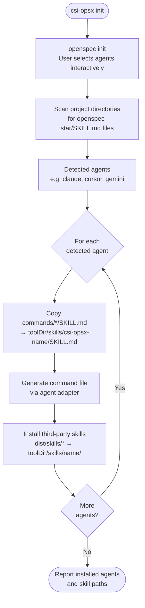
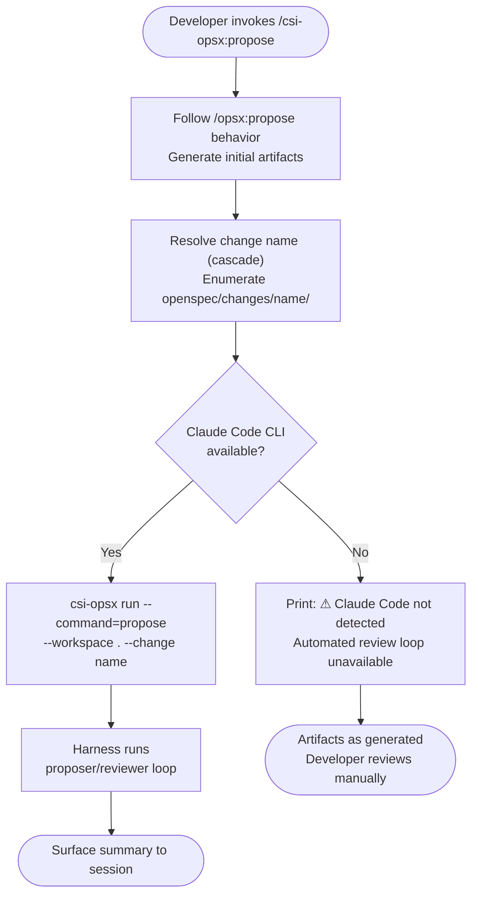
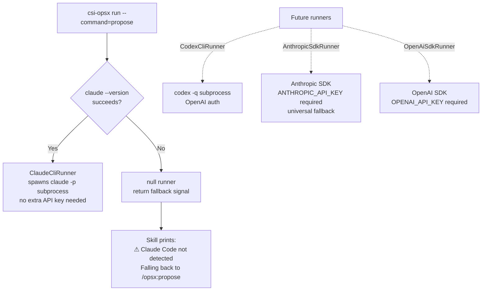

# csi-opsx Design Spec

**Date:** 2026-05-18  
**Status:** Draft  

---

## Overview

`csi-opsx` is an npm package that wraps OpenSpec to extend its workflow with automated review loops, grilling behavior during exploration, and agent-agnostic skill distribution. The developer experience mirrors OpenSpec: skills are invoked from within a coding agent session and no separate terminal is needed.

---

## Goals

- Automate the manual proposer/reviewer cycle that currently follows `/opsx:propose`
- Add `grill-with-docs` stress-testing to the explore phase
- Replace `openspec init/update` with `csi-opsx init/update` as the single entry point for the full workflow
- Be agent-agnostic for skill installation; Claude-first for harness execution with graceful fallback
- Be extensible: adding new wrapper commands or runner adapters should be low-friction

---

## Non-Goals

- Forking OpenSpec or maintaining its source code
- Implementing runner adapters for non-Claude agents in this iteration
- Modifying OpenSpec's artifact formats or schemas

---

## Package Identity

- **npm package name:** `csi-opsx`
- **CLI binary:** `csi-opsx`
- **Skill namespace:** `/csi-opsx:explore`, `/csi-opsx:propose`, `/csi-opsx:apply`, `/csi-opsx:archive`
- **OpenSpec dependency:** regular dependency (not peer), so `npm install -g csi-opsx` installs OpenSpec automatically
- **Language:** TypeScript, compiled to ESM via `tsup`
- **Source root:** `src/` — compiled output goes to `dist/` (gitignored)
- **`package.json` bin field** points to `dist/bin/cli.js` (compiled output, not source)

---

## Package Structure

```
csi-opsx/
  package.json              ← bin: { "csi-opsx": "./dist/bin/cli.js" }
  tsconfig.json
  src/
    bin/
      cli.ts                ← entry: init, update, run subcommands
    commands/
      explore/
        SKILL.md            ← behavioral instructions (agent-neutral, asset not compiled)
      propose/
        SKILL.md            ← behavioral instructions (agent-neutral, asset not compiled)
        agents.ts           ← ProposerAgent + ReviewerAgent configs
        harness.ts          ← proposer→reviewer loop orchestration
      apply/
        SKILL.md            ← behavioral instructions (asset, not compiled)
      archive/
        SKILL.md            ← behavioral instructions (asset, not compiled)
    lib/
      types.ts              ← ToolId, CommandName, AgentRole union types
      tools.ts              ← tool-id → skillsDir mapping (mirrors OpenSpec AI_TOOLS)
      tool-detection.ts     ← detects which agents are configured via OpenSpec skill files
      adapters/
        types.ts            ← SkillAdapter interface
        claude.ts           ← command file path + format for Claude Code
        index.ts            ← adapter registry + getAdapter() lookup
      install.ts            ← installSkills / installCommands / installThirdPartySkills
      runner/
        types.ts            ← Runner interface, RunnerOptions, RunnerResult
        index.ts            ← resolveRunner(): detects available runner
        claude/
          cli.ts            ← ClaudeCliRunner: spawns claude -p (acceptEdits, cwd=workspace); calls writePermissions internally
          permissions.ts    ← Claude-specific: builds .claude/settings.json (project read-only via deny + additionalDirectories) + fs-path→glob helper
      workspace.ts          ← temp dir creation, file copying, cleanup
      loop.ts               ← loop controller: reads findings, decides continue/exit
    skills/
      grill-with-docs/
        SKILL.md            ← bundled third-party skill (static copy, attribution comment)
        ADR-FORMAT.md       ← referenced by SKILL.md — must be co-located
        CONTEXT-FORMAT.md   ← referenced by SKILL.md — must be co-located
  dist/                     ← compiled output (gitignored)
    skills/                 ← third-party skill directories copied here by tsup onSuccess
```

**Build scripts (`package.json`):**
```json
{
  "scripts": {
    "build":     "tsup src/bin/cli.ts --format esm --dts",
    "typecheck": "tsc --noEmit",
    "dev":       "tsup src/bin/cli.ts --format esm --watch"
  },
  "devDependencies": {
    "typescript": "^5.0.0",
    "tsup":       "^8.0.0",
    "@types/node": "^20.0.0"
  }
}
```

`SKILL.md` files are markdown assets — `tsup` is configured to copy them into `dist/` alongside the compiled output so `csi-opsx init` can find them at runtime. The `onSuccess` hook also discovers all directories under `src/skills/` and copies each one wholesale to `dist/skills/`, preserving the directory structure so co-located support files (e.g. `ADR-FORMAT.md`) remain alongside their `SKILL.md`.

---

## CLI Commands

### `csi-opsx init`

1. Runs `openspec init` (delegates fully, stdio inherited)
2. Detects which agents OpenSpec configured by scanning for `{toolDir}/skills/openspec-*/SKILL.md` files
3. For each detected agent:
   - Copies `commands/*/SKILL.md` → `{toolDir}/skills/csi-opsx-{name}/SKILL.md`
   - Generates command file via agent adapter → agent-specific command path
   - Copies each `dist/skills/{name}/` directory → `{toolDir}/skills/{name}/` (third-party skills; all files preserved)
4. Reports installed agents and skill paths



### `csi-opsx update`

1. Runs `openspec update` (refreshes `/opsx:*` skills; does not touch `/csi-opsx:*` skills)
2. Re-runs the skill installation step from `init` (idempotent)

### `csi-opsx run --command=propose --workspace=<path> --change=<name> [--max-rounds=<n>]`

Internal subcommand. Called by the `/csi-opsx:propose` skill via Bash. Not intended for direct developer use.

- `--change`: the name of the change folder to review (e.g. `add-auth`). The harness enumerates `openspec/changes/<name>/` itself to build the artifact list — see **Trust Boundary**. The name must be a single safe path segment.
- `--max-rounds`: *(optional)* maximum number of reviewer→proposer rounds before the harness gives up and surfaces results for manual review. Defaults to 5 when omitted. Must be a positive integer.
- Resolves runner, enumerates the change folder, executes the proposer/reviewer loop, prints summary on exit

---

## Skill Behavior

### `/csi-opsx:explore`

Combines `/opsx:explore` and `grill-with-docs` behaviors in a single session. Both are active simultaneously from the start:

- **Explore behavior:** investigative conversation, no implementation decisions, no artifacts committed by explore itself
- **Grill behavior:** challenges terminology against existing glossary, proposes canonical terms, stress-tests with concrete scenarios, cross-references stated behavior against actual code
- **Outputs:** `CONTEXT.md` updated inline; ADRs created only for hard-to-reverse decisions with genuine trade-offs
- **Transition:** at end of session, surfaces a prompt to run `/csi-opsx:propose`

No harness, no subprocess, no file access enforcement — purely conversational.

### `/csi-opsx:propose [max-rounds]`

Optional argument: an integer that overrides the default round cap (5). Example: `/csi-opsx:propose 3` runs at most 3 reviewer→proposer rounds.

1. Follows `/opsx:propose` behavior to generate initial artifacts
2. Resolves the change name via a cascade: an explicit `/csi-opsx:propose <name>` argument → the change just created/continued in this session → otherwise scan `openspec/changes/` and ask the user if more than one is active. It always passes one concrete `--change`.
3. Guards against empty work: if no change folder is resolved or it has zero artifacts, stop with a notice — do not invoke the harness.
4. Checks if Claude Code CLI is available:
   - **Yes:** calls `csi-opsx run --command=propose --workspace . --change <name>` (with `--max-rounds=<integer>` appended if the user provided one); waits for harness to complete; surfaces summary
   - **No:** prints notice that automated review loop requires Claude Code; artifacts remain as generated by standard propose; developer reviews manually



### `/csi-opsx:apply`

Thin passthrough. Follows `/opsx:apply` behavior. No additional behavior in this iteration.

### `/csi-opsx:archive`

Thin passthrough. Follows `/opsx:archive` behavior. No additional behavior in this iteration.

---

## Propose Harness

### Runner Resolution

```
resolveRunner():
  if claude CLI available (claude --version succeeds) → ClaudeCliRunner
  else → null (skill falls back to /opsx:propose notice)
```

Future runners (CodexCliRunner, AnthropicSdkRunner, etc.) are added here as new features, each preceded by a dedicated research spike.



### Loop Structure

```mermaid
flowchart TD
    Start([Harness starts]) --> CR[Crash recovery:\nsweep orphaned temp dirs (scoped)]
    CR --> RS["Resumability: scan review-findings-*.md\nFind highest round N + status"]
    RS --> BRW["Build reviewer workspace\n<os-tmp>/csi-opsx-...-reviewer-N/\nReads artifacts + prev findings in place\nWrite: settings.json (project read-only)"]
    BRW --> SR["Spawn: claude -p reviewer\n--permission-mode acceptEdits\ncwd: <os-tmp>/csi-opsx-...-reviewer-N/"]
    SR --> CB1["Copy back: review-findings-N.md → project\nClean up temp dir"]
    CB1 --> CHK{issues-found?}
    CHK -- "= 0" --> EXIT([Exit: print summary])
    CHK -- "> 0" --> BPW["Build proposer workspace\n<os-tmp>/csi-opsx-...-proposer-N/\nCopy: artifacts + review-findings-N.md\nWrite: settings.json (project read-only)"]
    BPW --> SP["Spawn: claude -p proposer\n--permission-mode acceptEdits\ncwd: <os-tmp>/csi-opsx-...-proposer-N/"]
    SP --> CB2["Copy back: artifacts + findings (findings last)\nproposer set is-solved + status\nClean up temp dir"]
    CB2 --> INC[N++]
    INC --> BRW
```

### Full Cycle Sequence

```mermaid
sequenceDiagram
    participant Dev as Developer
    participant Skill as /csi-opsx:propose
    participant Harness as csi-opsx harness
    participant Rev as Reviewer Agent
    participant Prop as Proposer Agent

    Dev->>Skill: invoke /csi-opsx:propose
    Skill->>Skill: follow /opsx:propose behavior
    Note over Skill: generates proposal.md, design.md,<br/>tasks.md, spec.md
    Skill->>Harness: csi-opsx run --command=propose --change <name>

    loop Until issues-found = 0
        Harness->>Rev: claude -p reviewer prompt
        Note over Rev: temp workspace (cwd) — writes stay<br/>in workspace; project is read-only
        Rev-->>Harness: review-findings-N.md (issues-found: N)
        Harness->>Harness: parse issues-found field

        alt issues-found > 0
            Harness->>Prop: claude -p proposer prompt
            Note over Prop: temp workspace (cwd) — writes stay<br/>in workspace; project is read-only
            Prop-->>Harness: updated artifacts + findings (is-solved, status: addressed)
        end
    end

    Harness-->>Skill: exit 0 + summary
    Skill-->>Dev: ✓ complete — N rounds, 0 issues found
```

### Trust Boundary

The harness decides *what to review* by **enumerating the change folder**, not by trusting a list of paths passed to it.

- The internal `run` command takes `--change <name>` — a single change identifier, **not** a list of file paths. The harness builds the artifact list itself from `openspec/changes/<name>/`, so there is no externally-supplied path list to validate or be tricked into writing through.
- `<name>` must be a single safe path segment. The harness validates it against `^[A-Za-z0-9._-]+$` and rejects `.`, `..`, and any path separators **before** building any path — otherwise `--change ..` could climb out of the change folder and pull in unrelated files.
- Enumeration is deterministic: the same folder always yields the same artifact list, with no model involved in selecting paths.

**Artifacts that count** (relative to `openspec/changes/<name>/`): `proposal.md`, `design.md`, `tasks.md`, and any `specs/**/spec.md`. **Excluded:** `.openspec.yaml` (metadata) and the `review-findings-*.md` files. The optional artifacts (`design.md`, `tasks.md`) are tolerated when absent — the harness must not require them.

### Workspace Isolation & Write Sandbox

Each agent run executes in its own temporary workspace, with `cwd` set to that directory. The workspace holds exactly the files that agent is allowed to write (see **Workspace contents** below). The rule we enforce: **the agent may write only inside the workspace, and may read the project for context but not modify it.**

**The workspace directory is the write boundary.** Verified empirically with real `claude -p` runs (CLI 2.1.158): `--permission-mode acceptEdits` together with `cwd = workspace` gives exactly this boundary —

- writes/edits to files *inside* the workspace (including nested directories) are auto-accepted;
- writes/edits *outside* the workspace require approval, which is auto-denied in non-interactive (`-p`) mode — so they are blocked;
- reads *outside* the workspace are blocked the same way. (This corrects an earlier assumption that "Read is unrestricted." The working directory is a **two-way** boundary — it gates reads as well as writes.)

**Reading project context without copying it.** The agent still needs to read project files that live outside the workspace (`CLAUDE.md`, `openspec/specs/`, `docs/`). The runner re-grants read access to the project root through `additionalDirectories` in the workspace's `.claude/settings.json`. Because `additionalDirectories` grants *both* read and write, the runner also adds `deny` rules for the write tools on the project subtree. `deny` overrides both `allow` and the `acceptEdits` mode, so the project ends up **readable but not writable**, while the workspace stays writable.

```jsonc
// workspace/.claude/settings.json — written by writePermissions() before spawning
{
  "permissions": {
    "additionalDirectories": ["<projectRoot>"],   // read project context in place
    "deny": [
      "Write(//c/Users/me/project/**)",           // project is read-only…
      "Edit(//c/Users/me/project/**)"             // …deny beats allow + acceptEdits
    ]
  }
}
```

The runner spawns `claude -p <prompt> --permission-mode acceptEdits --setting-sources project` with `cwd` = the workspace. It deliberately does **not** allow the Bash tool (no `--allowedTools Bash`): Bash is the one path-agnostic way around a Write/Edit deny, and leaving it unlisted means it needs approval and is auto-denied under `-p`.

**The fs-path → permission-glob helper.** A `deny` rule's path is a *glob*, and the permission engine only recognizes an absolute path written in a platform-specific glob form:

- **Windows:** MSYS form — `//c/Users/me/project/**` (leading `//`, the drive letter as a lowercase path segment with **no colon**, forward slashes). The "natural" Windows forms (`C:\…`, `C:/…`, `/C:/…`, `//C:/…`) all silently fail to match — this was a real trap during the spike.
- **macOS / Linux:** `//Users/me/project/**` (the absolute path with one extra leading `/`).

So `permissions.ts` carries a small helper that converts an absolute filesystem path into this glob form. Two points:

- The helper is **pattern-only.** `additionalDirectories` takes a directory *path*, not a glob — it accepts the native path (`C:\…`) or a POSIX path (`/c/…`, `C:/…`) but **rejects** the `//c/…` glob form. Simplest approach: pass the project's native path to `additionalDirectories` untouched, and use the helper solely to build the `deny` patterns.
- Detect the path **shape** (e.g. a leading `C:` drive letter) rather than `process.platform`, so the helper is a pure string function that can be unit-tested for both operating systems from any machine.

**Testing the sandbox (acceptance criterion).** A `deny`-rule block does **not** show up in the `claude -p` JSON `permission_denials` array — that array only captures interactive "would-prompt → auto-denied" events, not pre-emptive deny-rule blocks. The ground truth is the **file state**. The integration test must therefore assert on files: an in-workspace write *succeeds* (the file exists) and an attempted project write *is blocked* (the project file is absent/unchanged). A JSON-shape unit test is explicitly **not** sufficient — asserting only the shape of `settings.json` is exactly what let the original, completely non-functional sandbox pass its tests.

**Runner contract.** File-access enforcement stays a runner-specific concern. The harness tells the runner, agent-neutrally, which directory is the writable workspace (`cwd`) and which directory is the read-only project root; each runner translates that into its own sandbox (for `ClaudeCliRunner`, the `settings.json` above). Future runners (CodexCliRunner, AnthropicSdkRunner) can enforce the same contract with a different config file or programmatic tool restrictions, without changing the harness.

**Workspace contents — the copy list *is* the write-allow-list.** Under `acceptEdits`, copying a file into the workspace is what makes it writable, so each agent's workspace holds exactly the files that agent is meant to change — and nothing more:

- *Reviewer* — a **pure consumer** of the artifacts. Its workspace is **empty**: it reads the artifacts and any prior `review-findings-(N-1).md` *in place* from the read-only change folder, and writes only `review-findings-N.md` into its workspace. The `deny` rules physically stop it from modifying the artifacts even if its prompt went astray — least privilege, enforced rather than merely requested.
- *Proposer* — its job **is** to edit the artifacts *and* record what it did, so its workspace holds **writable copies of the artifacts plus the current `review-findings-N.md`**. It edits the artifacts, sets each issue's `is-solved` + a resolution note, and flips the file-level `status: open → addressed` to attest its pass is complete.

After each run the harness copies back only what actually changed: `review-findings-N.md` after the reviewer, and the edited artifacts **and** the updated `review-findings-N.md` after the proposer. The proposer — not the harness — owns the `status` flip: only the agent that did the work can attest the pass is complete, and a crashed proposer must *not* leave a false `addressed` behind (see **Resumability & Crash Recovery**). The findings file is copied back **last**, so "the project says `addressed`" reliably implies the artifacts were already committed. Anything else an agent happens to create in its workspace is discarded.

### Workspace Naming & Cleanup

Each run's temp directory lives in the **shared OS temp dir** (`os.tmpdir()` — one scratch folder shared by every program and project on the machine), named deterministically:

```
csi-opsx-<projectBasename>-<pathHash8>-<change>-<role>-<round>
```

- `<change>`, `<role>`, and `<round>` keep every directory within a single loop distinct; since the reviewer and proposer run sequentially, only one directory per change is ever live.
- `<pathHash8>` is the first 8 hex chars of a SHA-256 of the *normalized* absolute project path (`path.resolve`, lowercased on Windows). Because the OS temp dir is one shared namespace, the basename alone could collide between two same-named checkouts (e.g. `~/work/csi-opsx` and `~/personal/csi-opsx`); the path hash disambiguates them while staying stable per project.

Cleanup:

- A run deletes its **own** directory on exit (success or handled failure) in a `finally`.
- Startup sweeps **orphaned** directories left by hard crashes, scoped to the current `<project>-<change>` prefix — never a global wipe, so a concurrent run on a *different* change or project is untouched.
- Running two propose loops on the **same** change at once is unsupported; the crash model bounds the damage to wasted work (copy-back commits only on a clean exit), not a corrupted project.

### `review-findings-N.md` Format

```markdown
---
issues-found: 2
round: 2
status: open
---

## Issue 1: [title]
is-solved: true
[reviewer's description]
**Resolution (proposer):** [what was changed]

## Issue 2: [title]
is-solved: false
[reviewer's description]
**Resolution (proposer):** Not solved — [reason]
```

**Who writes what** (raise → claim → verify):

- *Reviewer* writes the frontmatter (`issues-found`, `round`, `status: open`) and each issue's title, description, and `is-solved: false`.
- *Proposer* sets each issue's `is-solved` (`false → true`, or leaves `false` with a reason), adds a `**Resolution (proposer):**` note, and flips the frontmatter `status` to `addressed` when its pass is done. Its prompt forbids altering the reviewer's issue text or `issues-found`.
- The *next* round's reviewer is the real verification — its fresh `issues-found` is what tells us whether the issues were truly resolved.

**Two `status`-like signals, deliberately separate:**

- Frontmatter `status` (`open` → `addressed`) is a **phase marker** — "has the proposer finished its pass?" — and is the only status the harness reads.
- Per-issue `is-solved` (`true`/`false`) is the **disposition** of each issue — for agents and humans, never parsed by the harness.
- Using a distinct key (`is-solved`, not "status") *and* anchoring the harness's parser to the frontmatter block means a body `is-solved:` line — or stray "status:" text in a description — can never be mistaken for the file-level status. The harness parses only `issues-found` and the frontmatter `status`.

### Resumability & Crash Recovery

**The project is the checkpoint; the temp workspace is disposable scratch.** All resume state lives in the project's `review-findings-*.md` files — the harness persists nothing else, so a crash anywhere is recovered by re-reading the project. A workspace is copied back *only on a clean agent exit*; if a run crashes (or the harness itself is killed), the workspace is discarded, the project is left untouched, and the next invocation re-derives the correct step.

On startup the harness:

1. Sweeps orphaned temp dirs (see **Workspace Naming & Cleanup**).
2. Scans the project for `review-findings-*.md`, takes the highest round N, and reads its frontmatter `status`:
   - **No files** → start round 1 with the reviewer.
   - **`status: open`, issues > 0** → the reviewer produced findings but the proposer hasn't completed its pass → run the **proposer** for round N. (A proposer that crashed earlier never copied back, so the project is still at a clean round-N-open state; re-running is safe.)
   - **`status: addressed`** → the proposer finished round N → run the reviewer for round N+1.
   - **`status: open`, issues = 0** → loop already complete (no-op).

This precise resume is possible *because* the proposer owns the `status` flip: `open` reliably means "the proposer's turn," `addressed` means "the proposer finished." Re-running an agent from the same clean inputs is semantically idempotent — not bit-identical (LLM nondeterminism), but it addresses the same issues, and the next reviewer round verifies the outcome regardless.

### Artifact Enumeration

The harness derives the artifact list by **enumerating the change folder** (`openspec/changes/<name>/`), not by diffing file modification times. It checks for the three known filenames (`proposal.md`, `design.md`, `tasks.md`) and scans `specs/` for any `spec.md`. This replaces an earlier before/after `mtime` snapshot+diff approach, which could silently miss any artifact that `/explore` wrote but `/propose` did not subsequently touch, and which trusted a path list rather than deriving one. See **Trust Boundary** for why the change folder — not a diff — is the unit of review.

### Exit Summary

On clean exit (issues-found = 0):
```
✓ csi-opsx propose complete
  Rounds: 3
  Final review: 0 issues found
  Artifacts: proposal.md, design.md, tasks.md, openspec/specs/auth.md
  Review history: review-findings-1.md, review-findings-2.md, review-findings-3.md
```

On fallback (no runner available):
```
⚠ csi-opsx: Claude Code not detected.
  Automated review loop unavailable.
  Artifacts generated via standard /opsx:propose.
  Install Claude Code to enable the automated review loop.
```

---

## Agent-Agnostic Skill Installation

### Tool Detection

`csi-opsx init` detects configured agents by scanning for OpenSpec skill files:

```ts
// src/lib/tool-detection.ts
// For each known tool, check if openspec skills are installed
// Mirrors OpenSpec's getConfiguredTools() pattern
const TOOL_DIRS = {
  'claude':         '.claude',
  'cursor':         '.cursor',
  'gemini':         '.gemini',
  'codex':          '.codex',
  'github-copilot': '.github',
  // ... mirrors OpenSpec's AI_TOOLS skillsDir values
};

function getConfiguredTools(projectRoot) {
  return Object.entries(TOOL_DIRS)
    .filter(([, dir]) => hasOpenSpecSkills(projectRoot, dir))
    .map(([toolId]) => toolId);
}
```

### Skill and Command Installation

Skills and commands are distinct mechanisms in Claude Code (and most other agents) and `csi-opsx init` installs both:

**Skill files** — contain the behavioral instructions. Content is agent-neutral markdown, identical across all agents. Installed at:
```
{toolDir}/skills/csi-opsx-explore/SKILL.md
{toolDir}/skills/csi-opsx-propose/SKILL.md
{toolDir}/skills/csi-opsx-apply/SKILL.md
{toolDir}/skills/csi-opsx-archive/SKILL.md
```

**Command files** — create the invocable slash commands (e.g. `/csi-opsx:propose`). Format, content, and path are agent-specific and generated by the adapter in `src/lib/adapters/`. For Claude Code:
```
.claude/commands/csi-opsx/explore.md   → /csi-opsx:explore
.claude/commands/csi-opsx/propose.md   → /csi-opsx:propose
.claude/commands/csi-opsx/apply.md     → /csi-opsx:apply
.claude/commands/csi-opsx/archive.md   → /csi-opsx:archive
```

The command file is a thin entry point that references the skill behavior. The skill file holds the full multi-step instructions. For agents that only support one mechanism (skills OR commands, not both), the adapter installs whichever is appropriate for that agent.

### Backward Compatibility

`/opsx:*` skills are installed and managed entirely by OpenSpec. `csi-opsx` never writes to OpenSpec's skill directories. A developer can revert to standard OpenSpec at any time by invoking `/opsx:propose` instead of `/csi-opsx:propose` — no migration, no cleanup required.

---

## Extensibility Points

| What to extend | Where to add it |
|---|---|
| New wrapper command | Add `src/commands/{name}/SKILL.md`; add one import to `src/bin/cli.ts` |
| New harnessed command | Add `src/commands/{name}/SKILL.md`, `harness.ts`, `agents.ts`; wire `run --command={name}` |
| New runner adapter | Add `src/lib/runner/{name}/` with `cli.ts` (plus any agent-specific helpers like `permissions.ts`, `config.ts`); add detection check in `src/lib/runner/index.ts` |
| New agent for skill install | Add entry to `src/lib/tools.ts`; add adapter to `src/lib/adapters/` |
| New third-party skill | Add `src/skills/{name}/` with all skill files and an attribution comment in `SKILL.md`; tsup and install pick it up automatically |

---

## Open Questions

- Does `claude --version` reliably indicate that `claude -p` non-interactive mode is available, or is a more specific capability check needed?
- ~~Does `claude -p` in a subprocess correctly inherit the working directory's `.claude/settings.json` for permissions?~~ **Resolved (2026-05-30).** Yes — with `--setting-sources project` and `cwd` = workspace. The full sandbox mechanism (acceptEdits + workspace boundary + project read-only via `additionalDirectories`/`deny`, using the platform-specific glob form) was verified with real `claude -p` runs; see **Workspace Isolation & Write Sandbox**.
- Does OpenSpec (`validate`/`apply`/`archive`) tolerate `review-findings-*.md` living inside the change folder? Verify early; fall back to a dedicated `.csi-opsx/` location if it errors.
- Exact Codex CLI flags for non-interactive use — research spike before implementing CodexCliRunner.
