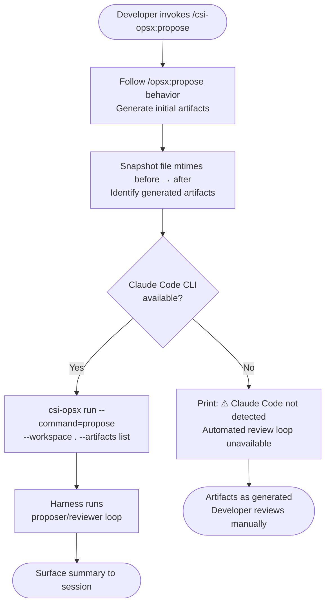
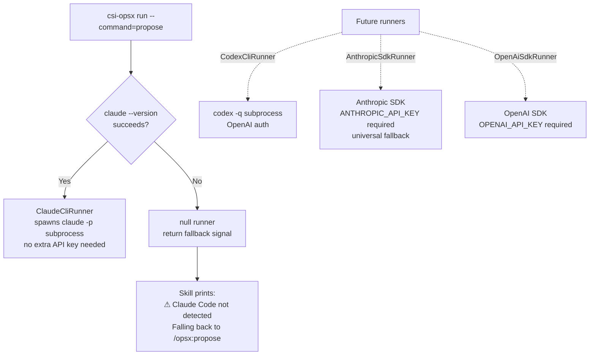
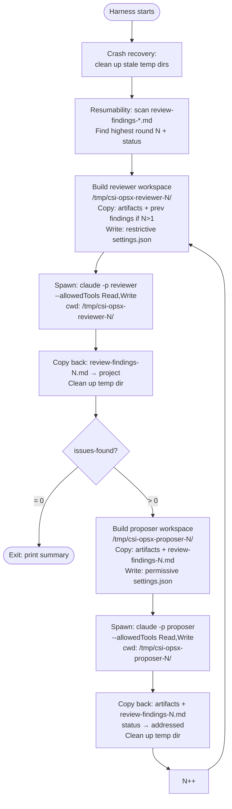
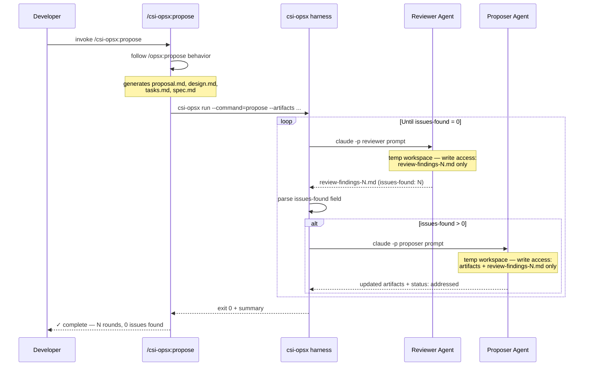

# csi-opsx Design Spec

**Date:** 2026-05-18  
**Status:** Draft  

---

## Overview

`csi-opsx` is an npm package that wraps OpenSpec to extend its workflow with automated review loops, grilling behavior during exploration, and agent-agnostic skill distribution. The developer experience mirrors OpenSpec: skills are invoked from within a coding agent session and no separate terminal is needed.

---

## Goals

- Automate the manual proposer/reviewer cycle that currently follows `/opsx:propose`
- Add `grill-with-docs` stress-testing to the explore phase
- Replace `openspec init/update` with `csi-opsx init/update` as the single entry point for the full workflow
- Be agent-agnostic for skill installation; Claude-first for harness execution with graceful fallback
- Be extensible: adding new wrapper commands or runner adapters should be low-friction

---

## Non-Goals

- Forking OpenSpec or maintaining its source code
- Implementing runner adapters for non-Claude agents in this iteration
- Modifying OpenSpec's artifact formats or schemas

---

## Package Identity

- **npm package name:** `csi-opsx`
- **CLI binary:** `csi-opsx`
- **Skill namespace:** `/csi-opsx:explore`, `/csi-opsx:propose`, `/csi-opsx:apply`, `/csi-opsx:archive`
- **OpenSpec dependency:** regular dependency (not peer), so `npm install -g csi-opsx` installs OpenSpec automatically
- **Language:** TypeScript, compiled to ESM via `tsup`
- **Source root:** `src/` — compiled output goes to `dist/` (gitignored)
- **`package.json` bin field** points to `dist/bin/cli.js` (compiled output, not source)

---

## Package Structure

```
csi-opsx/
  package.json              ← bin: { "csi-opsx": "./dist/bin/cli.js" }
  tsconfig.json
  src/
    bin/
      cli.ts                ← entry: init, update, run subcommands
    commands/
      explore/
        SKILL.md            ← behavioral instructions (agent-neutral, asset not compiled)
      propose/
        SKILL.md            ← behavioral instructions (agent-neutral, asset not compiled)
        agents.ts           ← ProposerAgent + ReviewerAgent configs
        harness.ts          ← proposer→reviewer loop orchestration
      apply/
        SKILL.md            ← behavioral instructions (asset, not compiled)
      archive/
        SKILL.md            ← behavioral instructions (asset, not compiled)
    lib/
      types.ts              ← ToolId, CommandName, AgentRole union types
      tools.ts              ← tool-id → skillsDir mapping (mirrors OpenSpec AI_TOOLS)
      tool-detection.ts     ← detects which agents are configured via OpenSpec skill files
      adapters/
        types.ts            ← SkillAdapter interface
        claude.ts           ← command file path + format for Claude Code
        index.ts            ← adapter registry + getAdapter() lookup
      install.ts            ← installSkills / installCommands / installThirdPartySkills
      runner/
        types.ts            ← Runner interface, RunnerOptions, RunnerResult
        index.ts            ← resolveRunner(): detects available runner
        claude/
          cli.ts            ← ClaudeCliRunner: spawns claude -p; calls writePermissions internally
          permissions.ts    ← Claude-specific: builds .claude/settings.json from writablePaths
      workspace.ts          ← temp dir creation, file copying, cleanup
      loop.ts               ← loop controller: reads findings, decides continue/exit
    skills/
      grill-with-docs/
        SKILL.md            ← bundled third-party skill (static copy, attribution comment)
        ADR-FORMAT.md       ← referenced by SKILL.md — must be co-located
        CONTEXT-FORMAT.md   ← referenced by SKILL.md — must be co-located
  dist/                     ← compiled output (gitignored)
    skills/                 ← third-party skill directories copied here by tsup onSuccess
```

**Build scripts (`package.json`):**
```json
{
  "scripts": {
    "build":     "tsup src/bin/cli.ts --format esm --dts",
    "typecheck": "tsc --noEmit",
    "dev":       "tsup src/bin/cli.ts --format esm --watch"
  },
  "devDependencies": {
    "typescript": "^5.0.0",
    "tsup":       "^8.0.0",
    "@types/node": "^20.0.0"
  }
}
```

`SKILL.md` files are markdown assets — `tsup` is configured to copy them into `dist/` alongside the compiled output so `csi-opsx init` can find them at runtime. The `onSuccess` hook also discovers all directories under `src/skills/` and copies each one wholesale to `dist/skills/`, preserving the directory structure so co-located support files (e.g. `ADR-FORMAT.md`) remain alongside their `SKILL.md`.

---

## CLI Commands

### `csi-opsx init`

1. Runs `openspec init` (delegates fully, stdio inherited)
2. Detects which agents OpenSpec configured by scanning for `{toolDir}/skills/openspec-*/SKILL.md` files
3. For each detected agent:
   - Copies `commands/*/SKILL.md` → `{toolDir}/skills/csi-opsx-{name}/SKILL.md`
   - Generates command file via agent adapter → agent-specific command path
   - Copies each `dist/skills/{name}/` directory → `{toolDir}/skills/{name}/` (third-party skills; all files preserved)
4. Reports installed agents and skill paths


### `csi-opsx update`

1. Runs `openspec update` (refreshes `/opsx:*` skills; does not touch `/csi-opsx:*` skills)
2. Re-runs the skill installation step from `init` (idempotent)

### `csi-opsx run --command=propose --workspace=<path> --artifacts=<csv>`

Internal subcommand. Called by the `/csi-opsx:propose` skill via Bash. Not intended for direct developer use.

- `--artifacts`: comma-separated list of files the propose step generated (e.g. `proposal.md,design.md,tasks.md,spec.md`)
- Resolves runner, executes the proposer/reviewer loop, prints summary on exit

---

## Skill Behavior

### `/csi-opsx:explore`

Combines `/opsx:explore` and `grill-with-docs` behaviors in a single session. Both are active simultaneously from the start:

- **Explore behavior:** investigative conversation, no implementation decisions, no artifacts committed by explore itself
- **Grill behavior:** challenges terminology against existing glossary, proposes canonical terms, stress-tests with concrete scenarios, cross-references stated behavior against actual code
- **Outputs:** `CONTEXT.md` updated inline; ADRs created only for hard-to-reverse decisions with genuine trade-offs
- **Transition:** at end of session, surfaces a prompt to run `/csi-opsx:propose`

No harness, no subprocess, no file access enforcement — purely conversational.

### `/csi-opsx:propose`

1. Follows `/opsx:propose` behavior to generate initial artifacts
2. Records which files were created/modified (snapshot before and after propose step)
3. Checks if Claude Code CLI is available:
   - **Yes:** calls `csi-opsx run --command=propose --workspace . --artifacts <list>`; waits for harness to complete; surfaces summary
   - **No:** prints notice that automated review loop requires Claude Code; artifacts remain as generated by standard propose; developer reviews manually



### `/csi-opsx:apply`

Thin passthrough. Follows `/opsx:apply` behavior. No additional behavior in this iteration.

### `/csi-opsx:archive`

Thin passthrough. Follows `/opsx:archive` behavior. No additional behavior in this iteration.

---

## Propose Harness

### Runner Resolution

```
resolveRunner():
  if claude CLI available (claude --version succeeds) → ClaudeCliRunner
  else → null (skill falls back to /opsx:propose notice)
```

Future runners (CodexCliRunner, AnthropicSdkRunner, etc.) are added here as new features, each preceded by a dedicated research spike.



### Loop Structure



### Full Cycle Sequence



### Workspace Isolation

Each agent run gets a temp directory containing only the files it needs to write. Context files (`CLAUDE.md`, `openspec/`, `docs/`, other spec files) are read from the real project via absolute paths included in the agent prompt — no copying required since Read is unrestricted.

**Reviewer workspace files:**
- All `--artifacts` files (copied from project)
- `review-findings-(N-1).md` if N > 1 (so reviewer can verify prior issues were addressed)

**Proposer workspace files:**
- All `--artifacts` files (copied from project)
- `review-findings-N.md` (issues to address)

### File Access Enforcement

File access enforcement is a runner-specific concern, not a harness concern. The harness specifies *what* it wants writable via `RunnerOptions.writablePaths` and lets each runner implement *how* to sandbox itself.

For `ClaudeCliRunner`, sandboxing happens via `.claude/settings.json` written into the temp workspace by `writePermissions()` (a private helper at `src/lib/runner/claude/permissions.ts`). `ClaudeCliRunner.run()` calls `writePermissions` before spawning `claude -p` whenever `writablePaths` is present. Claude Code reads the working directory's settings file, so running with `cwd` pointing at the temp workspace applies the restrictions without touching the project's settings.

```ts
// Harness side — agent-neutral
await runner.run({
  prompt: ReviewerAgent.buildPrompt(workspace, artifacts, round),
  workspaceDir: reviewerWs.dir,
  writablePaths: [`review-findings-${round}.md`],
});
```

```json
// ClaudeCliRunner writes this into the workspace before spawning
{ "permissions": { "allow": ["Write(review-findings-1.md)"], "deny": ["Write(*)"] } }
```

**Reviewer writablePaths:** `[ review-findings-N.md ]`

**Proposer writablePaths:** `[ ...artifacts, review-findings-N.md ]`

The exact artifact filenames come from `--artifacts`, so the writablePaths list is dynamic per invocation. Future runners (CodexCliRunner, AnthropicSdkRunner) will implement their own sandboxing logic — possibly a different config file, possibly programmatic tool restrictions — without changing the harness contract.

### `review-findings-N.md` Format

```markdown
---
issues-found: 3
round: 1
status: open
---

## Issue 1: [title]
[description]

## Issue 2: [title]
[description]
```

- `issues-found`: integer; harness reads this via regex to determine loop continuation
- `status`: `open` (reviewer wrote it) → `addressed` (proposer acted on it)
- The harness parses only `issues-found` and `status`; the issue descriptions are for the proposer and human reviewer

### Resumability

On startup the harness:
1. Scans project for `review-findings-*.md` files, extracts round numbers
2. Finds highest round N
3. Checks `status` field:
   - No files → start round 1 with reviewer
   - `status: open`, issues > 0 → proposer needs to run for round N
   - `status: addressed` → reviewer needs to run for round N+1
   - `status: open`, issues = 0 → loop already complete (no-op)

### Artifact Discovery

The `/csi-opsx:propose` skill snapshots the project's file modification times before and after the propose step runs, diffs the result, and passes changed files to the harness via `--artifacts`. This makes the workspace manifest and permissions dynamic — the harness works with whatever OpenSpec's propose step actually generates, without hardcoding filenames.

### Exit Summary

On clean exit (issues-found = 0):
```
✓ csi-opsx propose complete
  Rounds: 3
  Final review: 0 issues found
  Artifacts: proposal.md, design.md, tasks.md, openspec/specs/auth.md
  Review history: review-findings-1.md, review-findings-2.md, review-findings-3.md
```

On fallback (no runner available):
```
⚠ csi-opsx: Claude Code not detected.
  Automated review loop unavailable.
  Artifacts generated via standard /opsx:propose.
  Install Claude Code to enable the automated review loop.
```

---

## Agent-Agnostic Skill Installation

### Tool Detection

`csi-opsx init` detects configured agents by scanning for OpenSpec skill files:

```ts
// src/lib/tool-detection.ts
// For each known tool, check if openspec skills are installed
// Mirrors OpenSpec's getConfiguredTools() pattern
const TOOL_DIRS = {
  'claude':         '.claude',
  'cursor':         '.cursor',
  'gemini':         '.gemini',
  'codex':          '.codex',
  'github-copilot': '.github',
  // ... mirrors OpenSpec's AI_TOOLS skillsDir values
};

function getConfiguredTools(projectRoot) {
  return Object.entries(TOOL_DIRS)
    .filter(([, dir]) => hasOpenSpecSkills(projectRoot, dir))
    .map(([toolId]) => toolId);
}
```

### Skill and Command Installation

Skills and commands are distinct mechanisms in Claude Code (and most other agents) and `csi-opsx init` installs both:

**Skill files** — contain the behavioral instructions. Content is agent-neutral markdown, identical across all agents. Installed at:
```
{toolDir}/skills/csi-opsx-explore/SKILL.md
{toolDir}/skills/csi-opsx-propose/SKILL.md
{toolDir}/skills/csi-opsx-apply/SKILL.md
{toolDir}/skills/csi-opsx-archive/SKILL.md
```

**Command files** — create the invocable slash commands (e.g. `/csi-opsx:propose`). Format, content, and path are agent-specific and generated by the adapter in `src/lib/adapters/`. For Claude Code:
```
.claude/commands/csi-opsx/explore.md   → /csi-opsx:explore
.claude/commands/csi-opsx/propose.md   → /csi-opsx:propose
.claude/commands/csi-opsx/apply.md     → /csi-opsx:apply
.claude/commands/csi-opsx/archive.md   → /csi-opsx:archive
```

The command file is a thin entry point that references the skill behavior. The skill file holds the full multi-step instructions. For agents that only support one mechanism (skills OR commands, not both), the adapter installs whichever is appropriate for that agent.

### Backward Compatibility

`/opsx:*` skills are installed and managed entirely by OpenSpec. `csi-opsx` never writes to OpenSpec's skill directories. A developer can revert to standard OpenSpec at any time by invoking `/opsx:propose` instead of `/csi-opsx:propose` — no migration, no cleanup required.

---

## Extensibility Points

| What to extend | Where to add it |
|---|---|
| New wrapper command | Add `src/commands/{name}/SKILL.md`; add one import to `src/bin/cli.ts` |
| New harnessed command | Add `src/commands/{name}/SKILL.md`, `harness.ts`, `agents.ts`; wire `run --command={name}` |
| New runner adapter | Add `src/lib/runner/{name}/` with `cli.ts` (plus any agent-specific helpers like `permissions.ts`, `config.ts`); add detection check in `src/lib/runner/index.ts` |
| New agent for skill install | Add entry to `src/lib/tools.ts`; add adapter to `src/lib/adapters/` |
| New third-party skill | Add `src/skills/{name}/` with all skill files and an attribution comment in `SKILL.md`; tsup and install pick it up automatically |

---

## Open Questions

- Does `claude --version` reliably indicate that `claude -p` non-interactive mode is available, or is a more specific capability check needed?
- Does `claude -p` in a subprocess correctly inherit the working directory's `.claude/settings.json` for permissions? Needs verification in a real project before implementation.
- Exact Codex CLI flags for non-interactive use — research spike before implementing CodexCliRunner.
